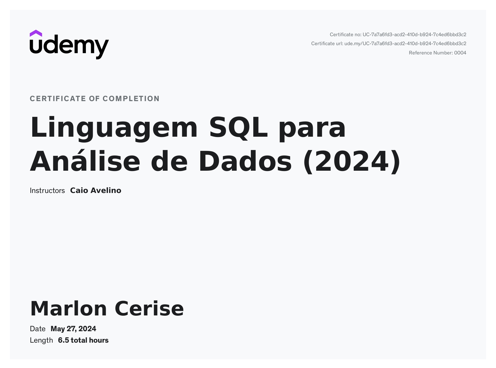

# Aprenda sobre Consultas a Banco de Dados utilizando Linguagem SQL com Google BigQuery

Este README documenta minha conclusão do curso **Aprenda sobre Consultas a Banco de Dados utilizando Linguagem SQL com Google BigQuery** na Udemy. Durante o curso, adquiri um profundo entendimento da Linguagem de Consulta de Dados (DQL) e das práticas de consulta em bancos de dados relacionais utilizando o Google BigQuery.

## O que Aprendi

- **DQL (Data Query Language)**
- **Estrutura de um Banco de Dados Relacional**
- **Consultas em Banco de Dados Relacional**
- **Estrutura das Consultas**
- **Principais Comandos e Operadores de SQL**
- **Funções de Agregação**
- **JOINS**
- **Google BigQuery**

## Certificado

Concluí o curso e recebi um certificado de conclusão. Você pode visualizar o certificado através dos links abaixo:

[Link para o Certificado PDF](./UC-7a7a6fd3-acd2-410d-b924-7c4ed6bbd3c2.pdf)
